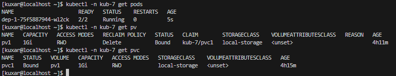
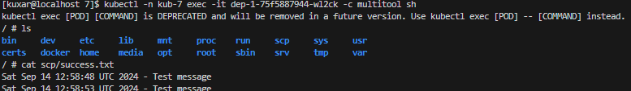
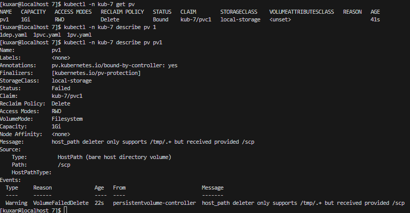
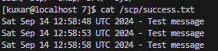
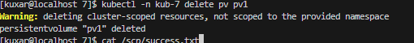

# kuber-07-keep-2

## Задание 1

```
 kubectl create namespace kub-7
```
### Запустил файлики

kubectl apply -n kub-7 -f [1dep.yaml](yaml/1dep.yaml)


 kubectl apply -n kub-7 -f [1pvc.yaml ](yaml/1pvc.yaml)


 kubectl apply -n kub-7 -f [1pv.yaml](yaml/1pv.yaml)

 ### Произвел проверку запуска *.yaml
```
 kubectl -n kub-7 get pv

 kubectl -n kub-7 get pvc

 kubectl -n kub-7 get all

 kubectl -n kub-7 get pod

 kubectl -n kub-7 describe pod dep-1-db88f79f8-dl4x6 
 ```
 


### Проверил что идет запись в файлик "success.txt"
```
 kubectl -n kub-7 exec -it dep-1-75f5887944-wl2ck -c multitool sh 
```

 


### Удалил "pvc" и "dep"
```
kubectl -n kub-7 delete deployment dep-1
kubectl -n kub-7 delete pvc pvc1
kubectl -n kub-7 get pv
kubectl -n kub-7 describe pv pv1
```
При удалении "pvc" и "dep" - "pv" переходит в состояние "Bound(Failed)" так как некчему подключаться данному волуму. 



Файлы которые записывались на данный пв сохранились



Через некоторое время после запуска пвс и деб пв обратно подключился.

Произвожу удаление пв

```
 kubectl -n kub-7 delete pv pv1
```


В моем случае данные которые находились в пв не удалятся так как ом был в режиме
"persistentVolumeReclaimPolicy: Delete"

если бы он был в режиме "persistentVolumeReclaimPolicy: Recycle" тогда данные будут утеряны


### Манифесты :

[1dep.yaml](yaml/1dep.yaml)

[1pvc.yaml ](yaml/1pvc.yaml)

 [1pv.yaml](yaml/1pv.yaml)

## Задание 2


Задание 1
Что нужно сделать

Создать Deployment приложения, использующего локальный PV, созданный вручную.

Создать Deployment приложения, состоящего из контейнеров busybox и multitool.
Создать PV и PVC для подключения папки на локальной ноде, которая будет использована в поде.
Продемонстрировать, что multitool может читать файл, в который busybox пишет каждые пять секунд в общей директории.
Удалить Deployment и PVC. Продемонстрировать, что после этого произошло с PV. Пояснить, почему.
Продемонстрировать, что файл сохранился на локальном диске ноды. Удалить PV. Продемонстрировать что произошло с файлом после удаления PV. Пояснить, почему.
Предоставить манифесты, а также скриншоты или вывод необходимых команд.
Задание 2
Что нужно сделать

Создать Deployment приложения, которое может хранить файлы на NFS с динамическим созданием PV.

Включить и настроить NFS-сервер на MicroK8S.
Создать Deployment приложения состоящего из multitool, и подключить к нему PV, созданный автоматически на сервере NFS.
Продемонстрировать возможность чтения и записи файла изнутри пода.
Предоставить манифесты, а также скриншоты или вывод необходимых команд.